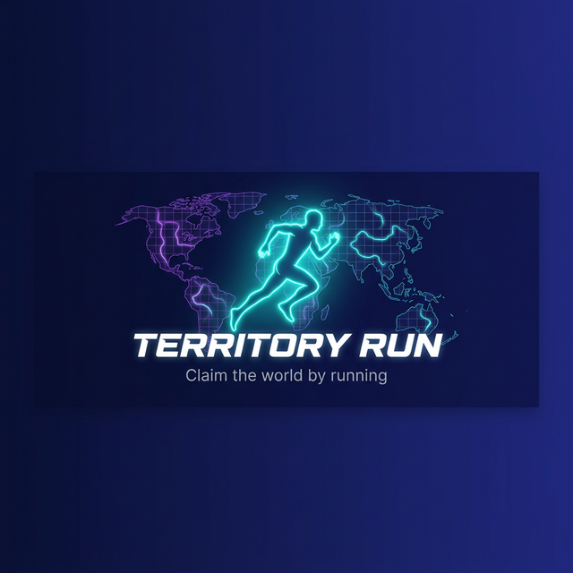

<p align="center">
  
</p>

<p align="center">
  <strong>🏜️ Claim the world by running.</strong><br>
  <em>A GPS fitness game where players claim real-world territory by running outdoors.</em>
</p>

<p align="center">
  <a href="https://flutter.dev"></a>
  <a href="https://firebase.google.com"></a>
  <a href="https://dart.dev"></a>
  <a href="https://developers.google.com/maps"></a>
</p>

<p align="center">
  <a href="#-features">Features</a> •
  <a href="#-screenshots">Screenshots</a> •
  <a href="#-tech-stack">Tech Stack</a> •
  <a href="#-getting-started">Getting Started</a> •
  <a href="#-roadmap">Roadmap</a> •
  <a href="#-contributing">Contributing</a>
</p>

---

## 💡 The Concept

> Every step you take outdoors **becomes your territory** on a shared world map. Other runners can challenge and reclaim your paths. The more you run, the bigger your empire grows.

Territory Run gamifies fitness by transforming daily runs into a competitive, location-based strategy game — think **Pokémon GO meets Strava**, but you're conquering real-world streets.

---

## ✨ Features

<table>
  <tr>
    <td align="center" width="25%">
      <h3>🗺️</h3>
      <strong>Interactive Map</strong><br>
      <sub>Google Maps with custom styling, territory overlays & real-time markers</sub>
    </td>
    <td align="center" width="25%">
      <h3>🏃</h3>
      <strong>Live Tracking</strong><br>
      <sub>See nearby active runners on the map in real-time via Firestore streams</sub>
    </td>
    <td align="center" width="25%">
      <h3>🚩</h3>
      <strong>Territory System</strong><br>
      <sub>Claim paths by running them, defend your turf from challengers</sub>
    </td>
    <td align="center" width="25%">
      <h3>🔥</h3>
      <strong>Heatmap</strong><br>
      <sub>Visualize running activity hotspots with toggleable map layers</sub>
    </td>
  </tr>
  <tr>
    <td align="center" width="25%">
      <h3>🏆</h3>
      <strong>Leaderboard</strong><br>
      <sub>Compete with runners in your neighbourhood and globally</sub>
    </td>
    <td align="center" width="25%">
      <h3>📊</h3>
      <strong>Stats & Streaks</strong><br>
      <sub>Track your 🔥 streaks, stamina, and personal records</sub>
    </td>
    <td align="center" width="25%">
      <h3>🌐</h3>
      <strong>Offline-First</strong><br>
      <sub>Run without internet — data syncs automatically when back online</sub>
    </td>
    <td align="center" width="25%">
      <h3>🔐</h3>
      <strong>Secure Auth</strong><br>
      <sub>Email/password + Google Sign-In via Firebase Authentication</sub>
    </td>
  </tr>
</table>

---

## 🖼️ Screenshots

<p align="center">
  <em>🚧 Screenshots coming soon — app is under active development!</em>
</p>

<!--
<p align="center">
  
  
  
  
</p>
-->

---

## 🛠️ Tech Stack

| Layer | Technology | Purpose |
|:------|:-----------|:--------|
| **Framework** |  | Cross-platform UI |
| **Language** |  | Application logic |
| **Auth** |  | User authentication |
| **Database** |  | Real-time data |
| **Maps** |  | Interactive map |
| **State** |  | State management |
| **Storage** |  | Offline-first local storage |
| **GPS** |  | Location tracking |

---

## 🚀 Getting Started

### Prerequisites

- [Flutter SDK](https://flutter.dev/docs/get-started/install) `3.x+`
- A [Firebase Project](https://console.firebase.google.com)
- A [Google Maps API Key](https://console.cloud.google.com)

### Quick Start

```bash
# Clone the repo
git clone https://github.com/Kumailameen-cyber/territory-run-.git
cd territory-run-

# Install dependencies
flutter pub get

# Run on Chrome (Web)
flutter run -d chrome

# Run on connected device
flutter run
```

### 🔥 Firebase Setup

1. Create a project at [console.firebase.google.com](https://console.firebase.google.com)
2. Enable **Email/Password** and **Google Sign-In** under Authentication
3. Generate and add your `firebase_options.dart`
4. Enable **Cloud Firestore** database

### 🗺️ Google Maps Setup

1. Enable **Maps JavaScript API** in [Google Cloud Console](https://console.cloud.google.com/apis/library/maps-backend.googleapis.com)
2. Add your API key to `web/index.html`

---

## 📁 Architecture

```
territory-run/
│
├── lib/
│   ├── core/
│   │   └── theme/              # 🎨 Colors, typography, theme data
│   │
│   ├── models/                 # 📦 Data models
│   │   ├── user_model.dart
│   │   ├── territory_model.dart
│   │   └── run_model.dart
│   │
│   ├── providers/              # 🧠 State management
│   │   ├── auth_provider.dart
│   │   ├── map_provider.dart
│   │   └── run_provider.dart
│   │
│   ├── screens/                # 📱 UI Screens
│   │   ├── auth/               #   Login & Signup
│   │   ├── map/                #   Main map dashboard
│   │   ├── running/            #   Active run overlay
│   │   ├── leaderboard/        #   Rankings
│   │   └── profile/            #   User profile
│   │
│   ├── services/               # ⚙️ Business logic
│   │   ├── auth_service.dart
│   │   ├── firestore_service.dart
│   │   ├── gps_service.dart
│   │   └── offline_storage_service.dart
│   │
│   ├── widgets/                # 🧩 Reusable components
│   │   ├── map_search_bar.dart
│   │   ├── map_filter_chips.dart
│   │   ├── streak_badge.dart
│   │   └── nearby_players_indicator.dart
│   │
│   ├── app.dart                # 🏗️ App root with providers
│   └── main.dart               # 🚀 Entry point
│
├── web/                        # 🌐 Web configuration
├── android/                    # 🤖 Android configuration
├── ios/                        # 🍎 iOS configuration
└── pubspec.yaml                # 📋 Dependencies
```

---

## 🗺️ Roadmap

### ✅ Completed
- [x] Firebase Authentication (Email + Google Sign-In)
- [x] Google Maps integration with custom styling
- [x] Real-time runner tracking via Firestore streams
- [x] Territory visualization with polylines & markers
- [x] Interactive search bar & filter chips
- [x] Offline-first architecture with Hive
- [x] Premium UI with responsive HUD

### 🔨 In Progress
- [ ] GPS run recording with path tracking
- [ ] Territory claiming algorithm

### 📋 Planned
- [ ] Leaderboard with Firestore backend
- [ ] Push notifications (territory challenges)
- [ ] Anti-cheat validation system
- [ ] Detailed profile & stats dashboard
- [ ] Dark mode toggle
- [ ] Social features (friends, teams)
- [ ] Achievement system & badges

---

## 🤝 Contributing

Contributions, issues, and feature requests are welcome!

```bash
# Fork the repo
# Create your feature branch
git checkout -b feature/amazing-feature

# Commit your changes
git commit -m "Add amazing feature"

# Push to your branch
git push origin feature/amazing-feature

# Open a Pull Request
```

---

## 📄 License

This project is licensed under the **MIT License** — see the [LICENSE](LICENSE) file for details.

---

<p align="center">
  <strong>Built with ❤️ and 🏃 by <a href="https://github.com/Kumailameen-cyber">Kumail Ameen</a></strong>
</p>

<p align="center">
  <sub>⭐ Star this repo if you find it interesting!</sub>
</p>
